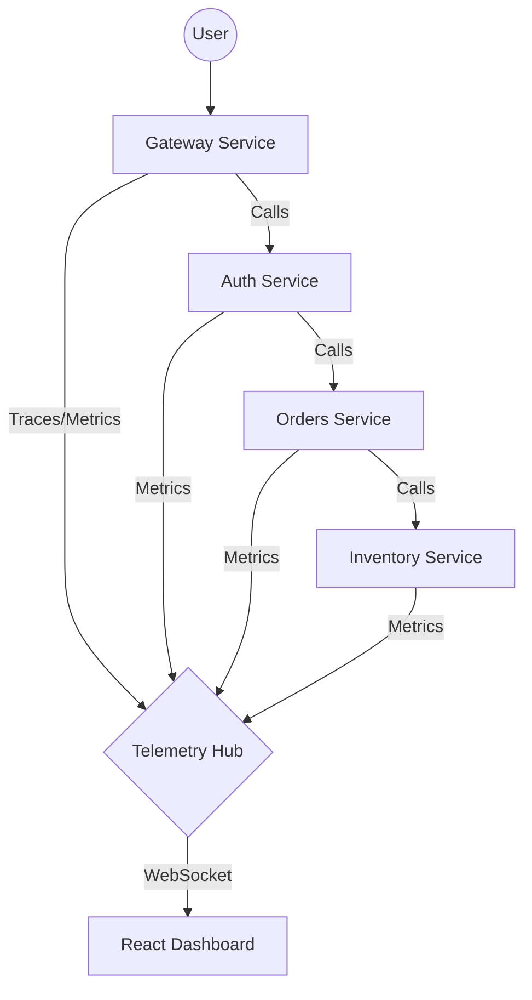

# 🌩️ CloudMesh — Enterprise Observability & Chaos Mesh

[](https://go.dev/)
[](https://react.dev/)
[]()
[](LICENSE)

**The Mission Control for your Microservices.** CloudMesh is a high-fidelity observability platform that moves beyond static dashboards. It combines real-time distributed tracing, autonomous self-healing via circuit breakers, and integrated Chaos Engineering into a single, "Cyber-Tech" inspired interface.

---

## ✨ Core Features

### 📡 Real-Time Service Mesh
Visualise your entire cluster's health at 60fps. Every request is tracked as it traverses the mesh from **Gateway → Auth → Orders → Inventory**.
*   **Sequential Visualization**: Requests pulse through nodes in their actual execution order.
*   **Live Telemetry**: Per-node metrics for CPU, Memory, and Open Connections via high-performance WebSockets.

### 🌊 Trace Waterfall Analysis
Click any `[TRACE]` log to open a high-fidelity Gantt chart. Identify the exact millisecond bottleneck in your distributed system before it impacts users.

### 🛡️ Autonomous Circuit Breakers
CloudMesh doesn't just watch failures—it stops them. Every service features an intelligent **Circuit Breaker** that trips to "Open" if error rates exceed 50%, returning `503 Service Unavailable` to prevent cascading system collapse.

### 🧪 Integrated Chaos Engine
Inject faults into production-grade Go binaries with a single click.
*   **Latency Injection**: Simulate network degradation with +1.5s propagation delays.
*   **5XX Flood**: Trigger intermittent service failures to test your system's resilience.

---

## 🏗️ The Architecture

CloudMesh is built as a true distributed system, not a simulation.



*   **Backend**: 5 Microservices written in high-performance Go.
*   **Frontend**: React 19 + Vanilla CSS (No utility frameworks, pure custom tech aesthetic).
*   **Data Plane**: Custom WebSocket broadcast system for sub-100ms state updates.

---

## 🔐 Enterprise Hardening

*   **JWT-Based Access Control**: The Chaos Engine is cryptographically locked. Every administrative command requires a signed JWT generated by the Dashboard's "System Keycard."
*   **Cryptographic Audit Logs**: Every fault injection is timestamped, attributed, and logged in an immutable backend-driven audit trail.
*   **Hardened Origin Security**: Strict CORS policies and WebSocket origin locking prevent Cross-Site WebSocket Hijacking (CSWSH).

---

## 🚀 Getting Started

### Prerequisites
*   [Go 1.26+](https://go.dev/dl/)
*   [Node.js 20+](https://nodejs.org/)

### 1. Clone & Install
```bash
git clone https://github.com/cybervales/cloudmesh.git
cd cloudmesh
npm install
```

### 2. Configure Environment
Set your JWT secret (required for Chaos Engine functionality):
```powershell
$env:CLOUDMESH_JWT_SECRET = "your-secure-secret-here"
```

### 3. Launch the Mesh
Run the stable boot orchestrator:
```powershell
./start-cloudmesh-stable.ps1
```

### 4. Access the Dashboard
Open **`http://localhost:5173`** and use the system keycard (Password: `admin`) to unlock the cluster.

---

## 🛡️ OWASP & STRIDE Compliance
This project has undergone a thorough security audit covering the **OWASP Top 10** and **STRIDE Threat Model**, resulting in a hardened posture against:
*   **Broken Access Control**: Protected via JWT Middleware.
*   **Injection**: JSON-safe ingestion pipeline.
*   **Information Disclosure**: Origin-locked telemetry streams.

---

Developed with ❤️ by [cybervales](https://github.com/cybervales)
